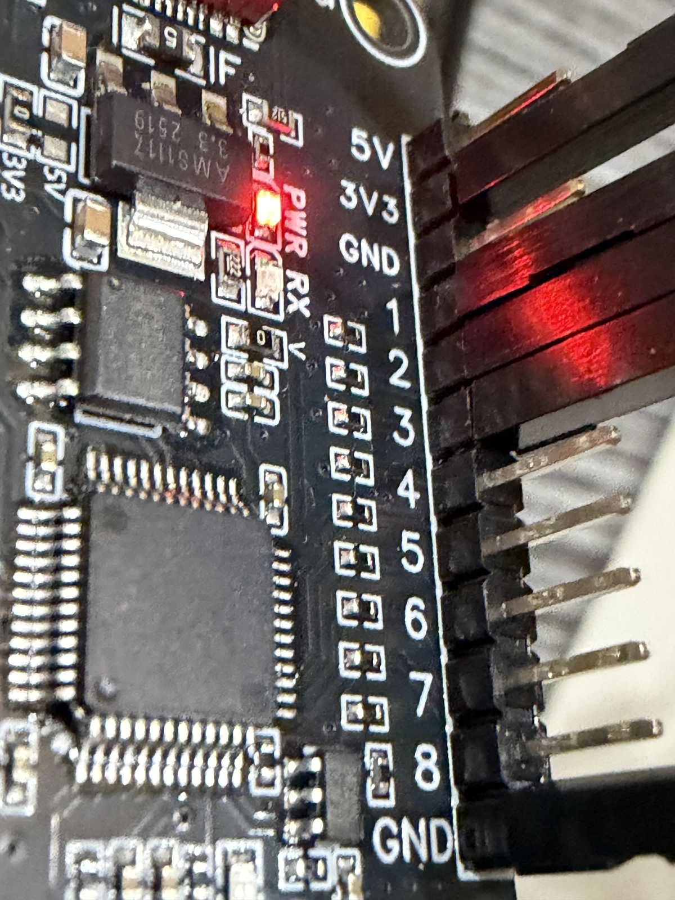
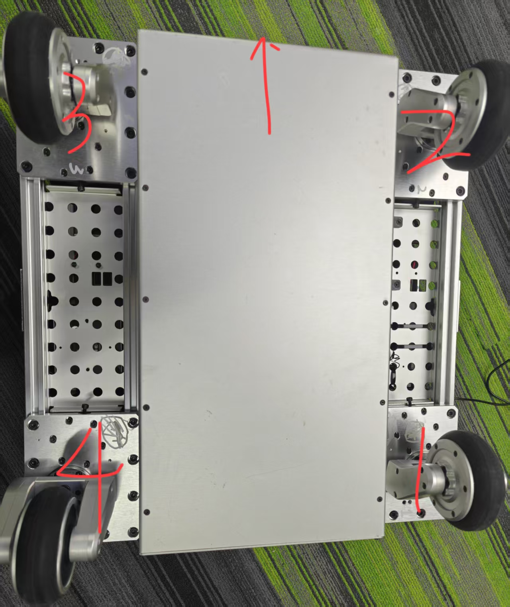
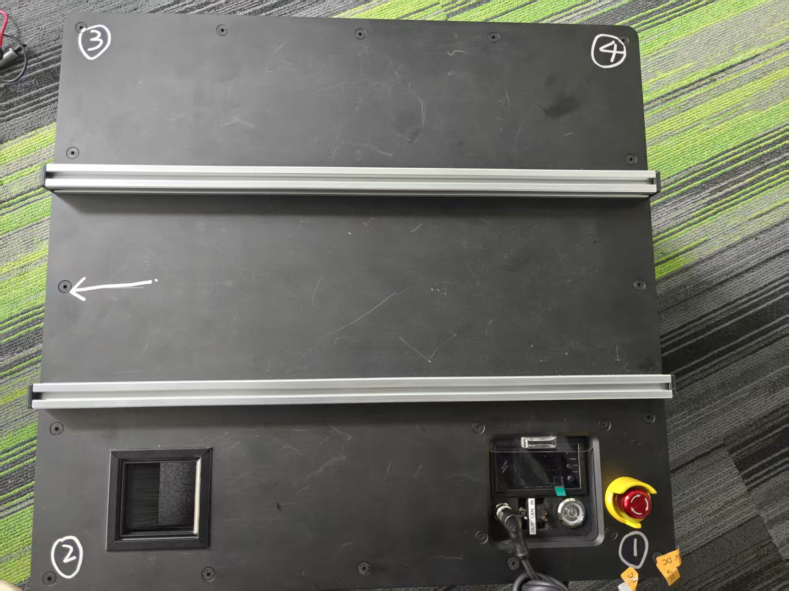
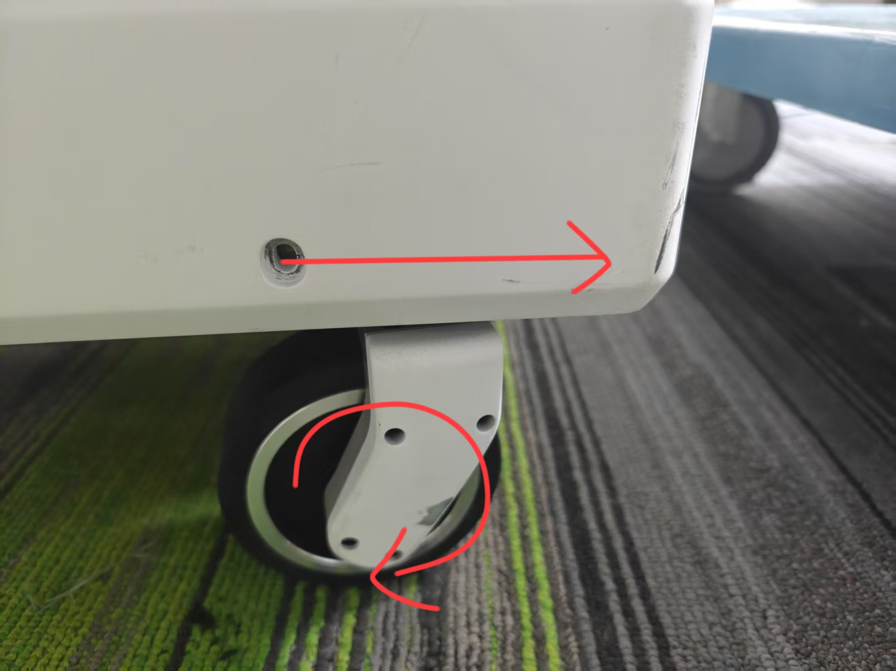
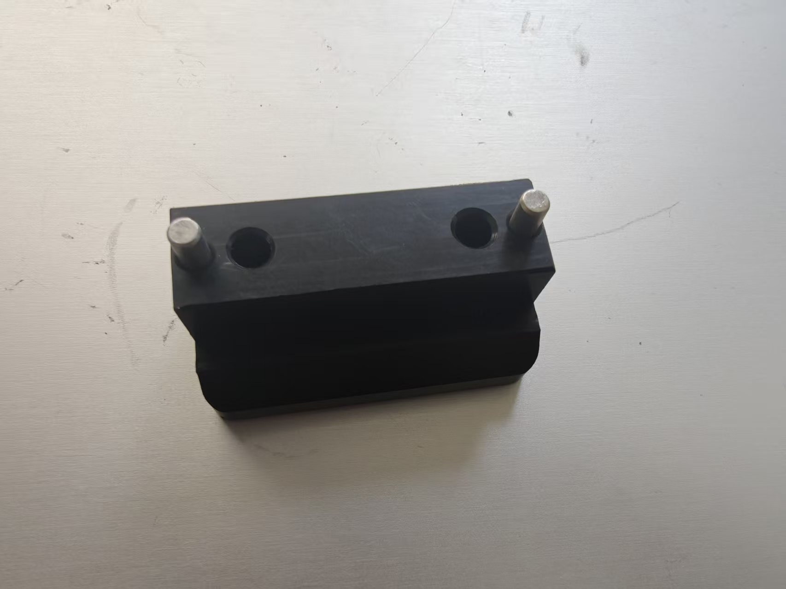

# Flow Base Setup Guide

## Important Notes

⚠️ **Software Updates**: The pre-installed software may be outdated. To access the latest features, log into the base and pull the newest i2rt codebase.

⚠️ **Pi Firmware**: Latest pi firmware is available [here](https://drive.google.com/drive/u/3/folders/1BAvdCFFR2lsmHqKH9YQ_lMbPV0TAIKik?dmr=1&ec=wgc-drive-globalnav-goto) under the PI_firmware folder. If your device doesn't have all necessary settings configured, remove the SD card and burn the latest firmware following [this instruction](../../devices/pi_setup.md).

## Getting Started

### Unboxing

Follow the detailed visual documentation provided in this [unboxing guide](https://www.canva.com/design/DAGvHpqzf-Y/C_ESTYVeHzDPKgkTQZTf0w/view?utm_content=DAGvHpqzf-Y&utm_campaign=designshare&utm_medium=link2&utm_source=uniquelinks&utlId=h74da76f842). Ensure the battery and charging port are connected correctly.

### Initial Setup

1. Install the battery and turn on the base
2. The screen will light up and the Raspberry Pi will begin booting
3. Verify the **E-stop** is **not pressed**
4. Ensure the **CAN bus selection switch** is in the **IN position**

<p align="center">
  
</p>

⚠️ **Note**: The small screen firmware may cause slower Pi boot times, but you can SSH into the system quickly once it's ready.

### Quick Start

1. Double-click the **FlowBase** icon on the desktop and run it in terminal
2. Turn on the remote to control the base
3. If the remote is unresponsive, toggle it off and on to wake it from sleep mode

## System Access

### Pi Login Credentials
- **Username**: `i2rt`
- **Password**: `root`

### SSH Access

**Option 1: Wireless Connection**
Connect the Pi to your local network via Wi-Fi (keyboard required for password entry).

**Option 2: Wired Connection**
The exposed RJ45 network interface is preconfigured with static IP `172.6.2.20`.

1. Connect your dev machine to the wired port with an ethernet cable
2. Configure your dev machine's network interface to use `172.6.2.*` IP range
3. SSH using:
   ```bash
   ssh i2rt@172.6.2.20 -J $USER_NAME@$YOUR_DEV_MACHINE_IP
   ```

## Remote Control

<p align="center">
  
</p>

### Control Layout

- **Left joystick**: Translation (XY movement)
- **Right joystick X-axis**: Rotation
- **Right joystick Y-axis**: Linear rail lift (up/down) - only available when linear rail is installed
- **Left1**: Reset odometry
- **Mode**: Switch between local and global coordinate modes
- **Left2**: Override API commands (safety feature)

### Important Notes
- The base has motion control limits with maximum acceleration constraints
- When you release the joystick (sending 0 command), the base won't stop immediately due to physics
- Always ensure the remote is awake when running API experiments - Left2 can override unexpected code behavior
- Speed and acceleration settings can be adjusted in [flow_base_controller](flow_base_controller.py#L742-L743)

⚠️ **Warning**: Setting overly aggressive speed or acceleration parameters can cause system instability.

## Coordinate Systems

### Local vs Global Mode

⚠️ **Odometry Warning**: Wheel odometry is prone to error accumulation and can be inaccurate. For mobile manipulation requiring precise odometry, integrate visual odometry sensors like RealSense T265 or ZED Camera.

- **Global mode**: Similar to drone headless mode, but wheel odometry errors accumulate
- **Local mode**: Relative to current base orientation
- Press **Mode** button to switch between coordinate systems
- Press **Left1** to reset odometry
- Base screen displays current command: `frame: global cmd: 0.0 0.0 0.0`

## API Control

### Network Setup
1. Connect base to Wi-Fi or use wired connection
2. Base IP address: `172.6.2.20`
3. Verify connectivity: `ping 172.6.2.20`

### Basic Commands

**Read Odometry:**
```python
python i2rt/flow_base/flow_base_client.py --command get_odometry --host 172.6.2.20
```

**Output:**
```bash
[Client] Connecting to 172.6.2.20:11323
[Client] Connection established
{
  'position': {'translation': array([-6.59e-07, -3.79e-04, 0.0]), 'rotation': array(-0.00022068)},
  'velocity': {
    'world': {'translation': array([0.0, 0.0, 0.0]), 'rotation': 0.0},
    'body':  {'translation': array([0.0, 0.0, 0.0]), 'rotation': 0.0},
  },
}
```

`position` is in the world frame (meters, radians). `translation` is a 3-D vector `[x, y, z]` — `x`/`y` come from wheel odometry, and `z` is the linear-rail height in meters when the rail is enabled (`0.0` otherwise). `velocity` is reported in both the world frame (`velocity.world`) and the base body frame (`velocity.body`) — pick whichever is convenient. `translation` is m/s, `rotation` is rad/s; the rail axis is vertical so `vz` is identical in world and body frames, and angular velocity is identical in both frames as well (the base only rotates about z).

**Reset Odometry:**
```python
python i2rt/flow_base/flow_base_client.py --command reset_odometry --host 172.6.2.20
```

**Test Movement** ⚠️ **Base will move**:
```python
python i2rt/flow_base/flow_base_client.py --command test_command --host 172.6.2.20
```

**Test Linear Rail** ⚠️ **Linear rail will move**:
```bash
python i2rt/flow_base/flow_base_client.py --command test_linear_rail --host 172.6.2.20
```

**Get Linear Rail State**:
```bash
python i2rt/flow_base/flow_base_client.py --command get_linear_rail_state --host 172.6.2.20
```

**Get Combined Observation** (odometry + wheel states, plus linear rail when `--with-linear-rail` is set):
```bash
# Odometry + wheel states
python i2rt/flow_base/flow_base_client.py --command get_observation --host 172.6.2.20

# Odometry + wheel states + linear rail
python i2rt/flow_base/flow_base_client.py --command get_observation --host 172.6.2.20 --with-linear-rail
```

**Output (with `--with-linear-rail`):**
```python
{
  'odometry':     { ... same shape as get_odometry ... },
  'wheel_states': { ... same shape as get_wheel_states ... },
  'linear_rail':  { ... same shape as get_linear_rail_state ... },
}
```
Without the flag, the `linear_rail` key is omitted; `odometry` and `wheel_states` are always returned.

**Get Wheel States** (per-motor pos/vel/torque for the 8 base motors):
```bash
python i2rt/flow_base/flow_base_client.py --command get_wheel_states --host 172.6.2.20
```

**`get_wheel_states()` output:**
```python
{
  'steer': {'pos': array([..4]), 'vel': array([..4]), 'eff': array([..4])},  # rad, rad/s, Nm
  'drive': {'pos': array([..4]), 'vel': array([..4]), 'eff': array([..4])},  # rad, rad/s, Nm
}
```
`eff` is motor torque in Nm. The 4 entries per group are the casters in chain order; the linear
rail (9th) motor is reported separately by `get_linear_rail_state()`.

Chain order matches the physical motor-ID wiring (steer, drive) → caster:

| Index | Motors (steer, drive) | Caster |
|-------|-----------------------|--------|
| 0 | 1, 2 | rear-left |
| 1 | 3, 4 | front-left |
| 2 | 5, 6 | front-right |
| 3 | 7, 8 | rear-right |

### Linear Rail API (if equipped)

If your FlowBase has a linear rail lift module installed, you can control it via API:

**Available Methods:**
- `get_linear_rail_state()` - Get position, velocity, limit-switch and calibration state
- `set_linear_rail_velocity(velocity)` - Set linear velocity in m/s (positive = up; converted to motor rad/s server-side using the calibrated `meters_per_rad`)
- `set_target_velocity([x, y, theta, rail_vel], frame)` - Combined base + rail control (4D; `rail_vel` in m/s)
- `get_observation()` - Returns `{odometry, wheel_states, linear_rail}` (the `linear_rail` key is included only when `with_linear_rail=True`)

Initialize with `FlowBaseClient(host="172.6.2.20", with_linear_rail=True)` to enable linear rail support.

The client clips every command axis to a configurable symmetric limit before sending:
`FlowBaseClient(..., max_vel_x=..., max_vel_y=..., max_vel_theta=..., max_vel_z=...)` —
`max_vel_x/y/z` in m/s, `max_vel_theta` in rad/s. Defaults are `0.5 / 0.5 / π/2 / 0.5`,
hard caps `1.0 / 1.0 / π / 1.0` (values outside `(0, cap]` raise `ValueError`).

**`get_linear_rail_state()` output:**
```python
{
  'position': {'motor': 0.314, 'linear': 0.050},   # rad, m
  'velocity': {'motor': -1.40, 'linear': -0.222},  # rad/s, m/s
  'eff': 0.85,                                      # Nm, rail motor torque
  'upper_limit_triggered': False,
  'lower_limit_triggered': False,
  'brake_on': False,
  'initialized': True,
  'meters_per_rad': 0.159,                          # m/rad, signed
}
```
`position.motor` / `velocity.motor` are the raw motor encoder readings (rad, rad/s). `position.linear` / `velocity.linear` are the corresponding linear quantities in m / m/s, derived from `meters_per_rad` captured at startup. Both are `None` until the rail has been calibrated.

**Startup calibration:**
- The rail drives up to the upper limit switch, captures the motor angle, then drives down to the lower limit switch and captures the motor angle again.
- `meters_per_rad = total_stroke_m / (theta_upper - theta_lower)`, where `total_stroke_m` is the physical stroke between the two limits (default `1.0` m, configurable via `LinearRailVehicle(total_stroke_m=...)`).
- The encoder is then zeroed at the lower limit, so `position.motor = 0` and `position.linear = 0` at the bottom of travel.
- If either move times out (default 30 s) or `|theta_upper − theta_lower|` is too small to calibrate, initialization raises `RuntimeError` and the vehicle aborts rather than running uncalibrated.

**Important Notes:**
- API velocity commands are physical units: `x`/`y`/`rail_vel` in m/s, `theta` in rad/s. The server converts the rail command to motor rad/s using the calibrated `meters_per_rad`; only the gamepad's normalized sticks are scaled by the server's `max_vel` / `lift_max_vel_ms`. Homing speed remains motor rad/s.
- Linear rail homes top-then-bottom and calibrates `meters_per_rad` on initialization
- Linear rail has limit switches that prevent movement beyond safe range
- Velocity commands timeout after 0.25s of inactivity (safety feature)
- Brake is automatically managed by the system (released on init, engaged on shutdown)
- To stop the rail, set velocity to 0.0 instead of controlling brake directly

### Safety Features
- API command timeout prevents runaway behavior (base: 0.25s, linear rail: 0.25s)
- FlowBaseClient automatically maintains command heartbeat
- Base and linear rail stop automatically when client disconnects
- Use remote Left2 to override API commands in emergencies
- Use remote Left1 to clear odometry during testing
- Linear rail limit switches provide hardware safety stops

## External Control

To control the base without the built-in Raspberry Pi:

1. Connect your external CAN device to the CAN external connector
2. Set the CAN selector switch to the **OUT position**
3. Clone the i2rt repository on your external computer
4. Install the udev rules so the CAN interface is auto-configured on connect:
   ```bash
   sudo devices/install_devices.sh
   ```
   This installs `devices/rules/flow_base.rules` into `/etc/udev/rules.d/`, which loads the `gs_usb` driver and brings the CAN interface up at 1 Mbit/s.
5. Control the base directly through your external system

### Linear Rail on x86 / non-Pi hosts (USB-GPIO converter)

On the built-in Raspberry Pi the linear rail's brake and limit switches use the Pi's native GPIO — no setup required. On an x86 / non-Pi host they are driven through a **bestep USB-to-16-channel GPIO converter** (hardware id `ZT-DPI/SY`) on a serial port. The backend is auto-selected from `platform.machine()`, so the control code is identical on both platforms.

<p align="center">
  
</p>

- `--device` is required on an x86 / non-Pi host whenever `--linear-rail` is set; on the Raspberry Pi it is not needed (native GPIO) and is ignored, e.g.
  ```bash
  python i2rt/flow_base/flow_base_controller.py --linear-rail --device /dev/ttyUSB0
  ```
  (The `I2RT_USB_GPIO_PORT` env var also works for programmatic use; the flag wins.)
- Converter channel wiring: **channel 1 = upper limit switch, channel 2 = lower limit switch, channel 3 = brake**.
- Requires `pyserial` (installed with the package).

Wiring (the `BCM N` are the controller's logical pins, mapped to converter channels by `USB_GPIO_CHANNEL_MAP`):

```text
x86 host --[USB 115200 8N1]--> bestep USB-to-16ch GPIO converter (ZT-DPI/SY),
                               enumerates as /dev/ttyUSB0
                               |
                               +-- 3.3V --> upper/lower limit switches (common)
                               +-- ch1  --> upper limit switch   (BCM 5)
                               +-- ch2  --> lower limit switch   (BCM 6)
                               +-- ch3  --> brake control signal (BCM 12)
                               +-- GND  --> brake driver GND
```

## Commissioning & Calibration

> One-time hardware bring-up for a **new base** (or after replacing a motor, wheel, or caster). A base shipped from the factory is already commissioned — you only need this if you built/repaired the drivetrain or the base fails the functional checks below. All commands assume the CAN interface is `can0`.

### 1. Motor IDs & Parameters

Each of the four casters has two Damiao (DM) motors — a **steering** motor (DM4310V) and a **drive** motor (DMH6215, or DM4310V on some units). The eight motors use CAN IDs **1–8**; the ID → caster mapping is the *Chain order* table in [API Control](#api-control) (steering = odd IDs 1/3/5/7, drive = even IDs 2/4/6/8). Identify each motor's caster and number from the physical layout:

<p align="center">
  
  
</p>

Configuration rules:
- **Master ID = CAN ID + 16** (DM protocol), so IDs 1–8 map to Master IDs 17–24.
- All motors run in **speed (velocity) mode**.
- Target per-motor register limits:

  | Motor | Model | `p_max` | `v_max` | `torque_max` |
  |-------|-------|---------|---------|--------------|
  | Steering | DM4310V | π (≈3.1416) rad | 30 rad/s | 10 Nm |
  | Drive | DMH6215 | 12.5 rad | 45 rad/s | 10 Nm |

IDs, control mode, and these limits are set with the **Damiao motor host tool** (上位机); this repository does not ship the interactive ID-config CLI. The low-level CAN register helpers live in [`motor_config_tool/utils.py`](../motor_config_tool/utils.py) (and [`set_timeout.py`](../motor_config_tool/set_timeout.py)) if you need to script register writes.

**Verify** every motor answers on the bus (reads only — motors briefly energize, no motion command is sent):
```bash
python i2rt/motor_config_tool/ping_motors.py --channel can0            # checks IDs 1–7
python i2rt/motor_config_tool/ping_motors.py --channel can0 --motor_id 8
```
Each responding motor prints its info and is listed under `online motors: [...]`.

### 2. Drive-Motor Direction

Every drive motor must spin the same way for a given base motion. The "forward" rotation convention is defined by the figure below — the straight arrow is the travel direction, the curved arrow is how the wheel turns:

<p align="center">
  
</p>

If a wheel is wired or mounted backwards, the base will creep or veer during the forward check in [§5](#5-functional-verification) — reinstall the motor/wheel or flip its direction. The controller also sanity-checks drive direction on startup.

### 3. Steering-Zero Calibration

**Only the steering motors need zeroing** — their zero must correspond to the wheel pointing straight forward, and all four wheels must end up parallel.

1. With the motors **disabled**, manually rotate each caster so the wheel points straight ahead. Use the alignment-pin fixture to lock the casters square:

   <p align="center">
     
     
   </p>

2. Save the current position as the hardware zero for each steering motor (IDs 1, 3, 5, 7), one at a time:
   ```bash
   python i2rt/motor_config_tool/set_zero.py --channel can0 --motor_id 1
   python i2rt/motor_config_tool/set_zero.py --channel can0 --motor_id 3
   python i2rt/motor_config_tool/set_zero.py --channel can0 --motor_id 5
   python i2rt/motor_config_tool/set_zero.py --channel can0 --motor_id 7
   ```
   Running `set_zero.py` with no `--motor_id` zeroes motors 1–7 (drive motors included) — pass `--motor_id` explicitly to zero the steering motors only.

### 4. Kinematics Parameters

The swerve kinematics constants live in [`flow_base_controller.py`](flow_base_controller.py) — refer to the code rather than re-listing the numbers here:
- Caster hip positions `h_x, h_y` (line ~41), in **motor-chain order** with the body convention **+x forward, +y left**. The sign/order therefore differ from the internal SOP's per-wheel table even though the 0.2 m magnitudes match.
- Caster offset `b_x` / `b_y` and wheel radius `r` (lines ~95–97).
- Per-caster steering calibration `STEERING_OFFSET` / `STEERING_DIRECTION` (lines ~49–50).

Velocity and acceleration limits are already covered under [Remote Control](#remote-control) and [API Control](#api-control) above; the values are configured in `flow_base_controller.py`.

### 5. Functional Verification

> ⚠️ **Invert the base (or raise it so all wheels are off the ground) before running these — the base will try to drive.**

With the base controller running, send each velocity command and confirm the expected motion. The quickest way is the API client, which keeps the command heartbeat alive and clips each axis to its configured `max_vel` (see [API Control](#api-control)):

```python
import time
import numpy as np
from i2rt.flow_base.flow_base_client import FlowBaseClient

client = FlowBaseClient(host="172.6.2.20")   # heartbeat runs in the background
client.set_target_velocity(np.array([1.0, 0.0, 0.0]), frame="local")  # forward
time.sleep(5)
client.set_target_velocity(np.zeros(3), frame="local")                # stop
client.close()
```

| Command `[x, y, θ]` | Expected motion | Common fault → cause |
|---------------------|-----------------|----------------------|
| `[1, 0, 0]` | Wheels straight, base drives **straight forward** | Drives backward → drive direction wrong; veers → steering zero off or geometry error |
| `[0, 0, 1]` | Wheels toe in, base **spins in place** (CCW) | Translates instead → steering zero off; spins the wrong way → steering direction wrong |
| `[0, 1, 0]` | Wheels at 90°, base **strafes** sideways, heading fixed | Heading rotates → steering zero off; angle ≠ 90° → steering zero offset |
| `[1, 1, 0]` | Base moves on a **45° diagonal** | Direction ≠ 45° → x/y drive mismatch or geometry error |
| `[1, 0, 1]` | Forward **and** rotating (spiral) | Only one component present → check the corresponding motor group |

Adjust the vector in the snippet for each row; hold ~5–10 s, then command zero. For continuous manual control instead, use gamepad teleop (see §6).

### 6. Gamepad & Controller Run Test

Final check with the real controller:
```bash
python i2rt/flow_base/flow_base_controller.py            # remote / API teleop
python i2rt/flow_base/flow_base_controller.py --gamepad  # wired-gamepad teleop
```
To debug a gamepad's raw axis/button values, run the standalone reader:
```bash
python -m i2rt.utils.gamepad_utils
```
Gamepad notes: set a Logitech pad to **D (DirectInput) mode** before launching, then let the sticks settle — on startup the pad may report residual non-zero values, so wait until the printed axes read ~0 before driving. This wired gamepad is separate from the wireless RC remote in [Remote Control](#remote-control).

The controller should initialize all motors, respond smoothly to input, and move without abnormal vibration or noise. If startup fails, check CAN wiring and re-run the motor verification in §1; if motion is rough or veers, re-check the steering-zero calibration in §3.

## Troubleshooting

- **Remote unresponsive**: Toggle remote off and on to wake from sleep
- **Slow boot**: Screen firmware causes delays, but SSH access is available quickly
- **Inaccurate odometry**: Expected with wheel-based systems, especially during aggressive movements
- **Linear rail not homing**: Check GPIO connections and limit switches. Ensure brake is released. On x86, confirm the USB-GPIO converter is on the path given by `--device` (default `/dev/ttyUSB0`) and that `pyserial` is installed
- **Linear rail stuck at limit**: Check limit switch state. Use `get_linear_rail_state()` to verify switch status
