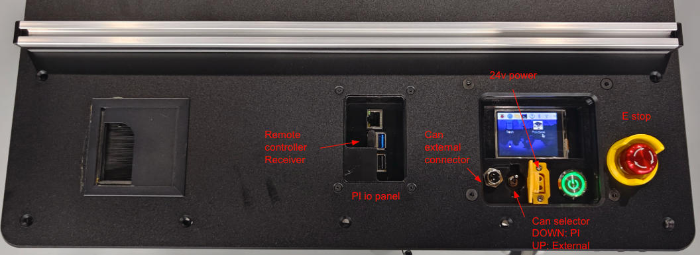

# Flow Base Setup Guide

## Important Notes

⚠️ **Software Updates**: The pre-installed software may be outdated. To access the latest features, log into the base and pull the newest i2rt codebase.

⚠️ **Pi Firmware**: Latest pi firmware is available [here](https://drive.google.com/drive/u/3/folders/1BAvdCFFR2lsmHqKH9YQ_lMbPV0TAIKik?dmr=1&ec=wgc-drive-globalnav-goto) under the PI_firmware folder. If your device doesn't have all necessary settings configured, remove the SD card and burn the latest firmware following [this instruction](../../devices/pi_setup.md).

## Getting Started

### Unboxing

Follow the detailed visual documentation provided in this [unboxing guide](https://www.canva.com/design/DAGvHpqzf-Y/C_ESTYVeHzDPKgkTQZTf0w/view?utm_content=DAGvHpqzf-Y&utm_campaign=designshare&utm_medium=link2&utm_source=uniquelinks&utlId=h74da76f842). Ensure the battery and charging port are connected correctly.

### Initial Setup

1. Install the battery and turn on the base
2. The screen will light up and the Raspberry Pi will begin booting
3. Verify the **E-stop** is **not pressed**
4. Ensure the **CAN bus selection switch** is in the **UP position**

<p align="center">
  
</p>

⚠️ **Note**: The small screen firmware may cause slower Pi boot times, but you can SSH into the system quickly once it's ready.

### Quick Start

1. Double-click the **FlowBase** icon on the desktop and run it in terminal
2. Turn on the remote to control the base
3. If the remote is unresponsive, toggle it off and on to wake it from sleep mode

## System Access

### Pi Login Credentials
- **Username**: `i2rt`
- **Password**: `root`

### SSH Access

**Option 1: Wireless Connection**
Connect the Pi to your local network via Wi-Fi (keyboard required for password entry).

**Option 2: Wired Connection**
The exposed RJ45 network interface is preconfigured with static IP `172.6.2.20`.

1. Connect your dev machine to the wired port with an ethernet cable
2. Configure your dev machine's network interface to use `172.6.2.*` IP range
3. SSH using:
   ```bash
   ssh i2rt@172.6.2.20 -J $USER_NAME@$YOUR_DEV_MACHINE_IP
   ```

## Remote Control

<p align="center">
  
</p>

### Control Layout

- **Left joystick**: Translation (XY movement)
- **Right joystick X-axis**: Rotation
- **Right joystick Y-axis**: Linear rail lift (up/down) - only available when linear rail is installed
- **Left1**: Reset odometry
- **Mode**: Switch between local and global coordinate modes
- **Left2**: Override API commands (safety feature)

### Important Notes
- The base has motion control limits with maximum acceleration constraints
- When you release the joystick (sending 0 command), the base won't stop immediately due to physics
- Always ensure the remote is awake when running API experiments - Left2 can override unexpected code behavior
- Speed and acceleration settings can be adjusted in [flow_base_controller](flow_base_controller.py#L500-L501)

⚠️ **Warning**: Setting overly aggressive speed or acceleration parameters can cause system instability.

## Coordinate Systems

### Local vs Global Mode

⚠️ **Odometry Warning**: Wheel odometry is prone to error accumulation and can be inaccurate. For mobile manipulation requiring precise odometry, integrate visual odometry sensors like RealSense T265 or ZED Camera.

- **Global mode**: Similar to drone headless mode, but wheel odometry errors accumulate
- **Local mode**: Relative to current base orientation
- Press **Mode** button to switch between coordinate systems
- Press **Left1** to reset odometry
- Base screen displays current command: `frame: global cmd: 0.0 0.0 0.0`

## API Control

### Network Setup
1. Connect base to Wi-Fi or use wired connection
2. Base IP address: `172.6.2.20`
3. Verify connectivity: `ping 172.6.2.20`

### Basic Commands

**Read Odometry:**
```python
python i2rt/flow_base/flow_base_client.py --command get_odometry --host 172.6.2.20
```

**Output:**
```bash
[Client] Connecting to 172.6.2.20:11323
[Client] Connection established
{
  'position': {'translation': array([-6.59e-07, -3.79e-04, 0.0]), 'rotation': array(-0.00022068)},
  'velocity': {
    'world': {'translation': array([0.0, 0.0, 0.0]), 'rotation': 0.0},
    'body':  {'translation': array([0.0, 0.0, 0.0]), 'rotation': 0.0},
  },
}
```

`position` is in the world frame (meters, radians). `translation` is a 3-D vector `[x, y, z]` — `x`/`y` come from wheel odometry, and `z` is the linear-rail height in meters when the rail is enabled (`0.0` otherwise). `velocity` is reported in both the world frame (`velocity.world`) and the base body frame (`velocity.body`) — pick whichever is convenient. `translation` is m/s, `rotation` is rad/s; the rail axis is vertical so `vz` is identical in world and body frames, and angular velocity is identical in both frames as well (the base only rotates about z).

**Reset Odometry:**
```python
python i2rt/flow_base/flow_base_client.py --command reset_odometry --host 172.6.2.20
```

**Test Movement** ⚠️ **Base will move**:
```python
python i2rt/flow_base/flow_base_client.py --command test_command --host 172.6.2.20
```

**Test Linear Rail** ⚠️ **Linear rail will move**:
```bash
python i2rt/flow_base/flow_base_client.py --command test_linear_rail --host 172.6.2.20
```

**Get Linear Rail State**:
```bash
python i2rt/flow_base/flow_base_client.py --command get_linear_rail_state --host 172.6.2.20
```

**Get Combined Observation** (odometry, plus linear rail when `--with-linear-rail` is set):
```bash
# Odometry only
python i2rt/flow_base/flow_base_client.py --command get_observation --host 172.6.2.20

# Odometry + linear rail
python i2rt/flow_base/flow_base_client.py --command get_observation --host 172.6.2.20 --with-linear-rail
```

**Output (with `--with-linear-rail`):**
```python
{
  'odometry':    { ... same shape as get_odometry ... },
  'linear_rail': { ... same shape as get_linear_rail_state ... },
}
```
Without the flag, only the `odometry` key is returned.

### Linear Rail API (if equipped)

If your FlowBase has a linear rail lift module installed, you can control it via API:

**Available Methods:**
- `get_linear_rail_state()` - Get position, velocity, limit-switch and calibration state
- `set_linear_rail_velocity(velocity)` - Set velocity in rad/s
- `set_target_velocity([x, y, theta, rail_vel], frame)` - Combined base + rail control (4D)
- `get_observation()` - Returns `{odometry, linear_rail}` (the `linear_rail` key is included only when `with_linear_rail=True`)

Initialize with `FlowBaseClient(host="172.6.2.20", with_linear_rail=True)` to enable linear rail support.

**`get_linear_rail_state()` output:**
```python
{
  'position': {'motor': 0.314, 'linear': 0.050},   # rad, m
  'velocity': {'motor': -1.40, 'linear': -0.222},  # rad/s, m/s
  'upper_limit_triggered': False,
  'lower_limit_triggered': False,
  'brake_on': False,
  'initialized': True,
  'meters_per_rad': 0.159,                          # m/rad, signed
}
```
`position.motor` / `velocity.motor` are the raw motor encoder readings (rad, rad/s). `position.linear` / `velocity.linear` are the corresponding linear quantities in m / m/s, derived from `meters_per_rad` captured at startup. Both are `None` until the rail has been calibrated.

**Startup calibration:**
- The rail drives up to the upper limit switch, captures the motor angle, then drives down to the lower limit switch and captures the motor angle again.
- `meters_per_rad = total_stroke_m / (theta_upper - theta_lower)`, where `total_stroke_m` is the physical stroke between the two limits (default `1.0` m, configurable via `LinearRailVehicle(total_stroke_m=...)`).
- The encoder is then zeroed at the lower limit, so `position.motor = 0` and `position.linear = 0` at the bottom of travel.
- If either move times out (default 30 s) or `|theta_upper − theta_lower|` is too small to calibrate, initialization raises `RuntimeError` and the vehicle aborts rather than running uncalibrated.

**Important Notes:**
- Linear rail homes top-then-bottom and calibrates `meters_per_rad` on initialization
- Linear rail has limit switches that prevent movement beyond safe range
- Velocity commands timeout after 0.25s of inactivity (safety feature)
- Brake is automatically managed by the system (released on init, engaged on shutdown)
- To stop the rail, set velocity to 0.0 instead of controlling brake directly

### Safety Features
- API command timeout prevents runaway behavior (base: 0.25s, linear rail: 0.25s)
- FlowBaseClient automatically maintains command heartbeat
- Base and linear rail stop automatically when client disconnects
- Use remote Left2 to override API commands in emergencies
- Use remote Left1 to clear odometry during testing
- Linear rail limit switches provide hardware safety stops

## External Control

To control the base without the built-in Raspberry Pi:

1. Connect your external CAN device to the CAN external connector
2. Set the CAN selector switch to the **DOWN position**
3. Clone the i2rt repository on your external computer
4. Control the base directly through your external system

## Troubleshooting

- **Remote unresponsive**: Toggle remote off and on to wake from sleep
- **Slow boot**: Screen firmware causes delays, but SSH access is available quickly
- **Inaccurate odometry**: Expected with wheel-based systems, especially during aggressive movements
- **Linear rail not homing**: Check GPIO connections and limit switches. Ensure brake is released
- **Linear rail stuck at limit**: Check limit switch state. Use `get_linear_rail_state()` to verify switch status
