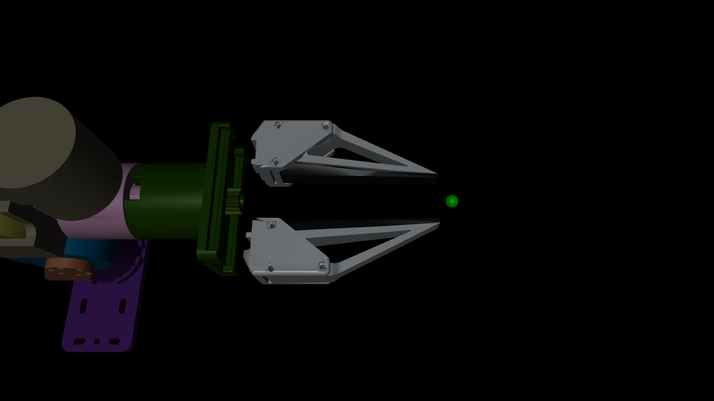

# Custom UMI Flow fingers on the linear_4310 gripper

This fork uses the supplied **YAM-UMI Flow Finger v11** STEP assembly (including
UMI_Flow_Chopstick_fingers v9) instead of the original i2rt finger geometry.
`cad/umi_flow_fingers.step` is the source; each side has an adapter, finger, and pad.
The motor housing is unchanged. The CAD export's 120 mm assembly spacing is not a
jaw setting: each assembly is registered independently to its existing slide body.

## Mount registration and dimensions

STEP units are millimetres. The CAD-to-flange coordinate map is
`(x,y,z) = (Z,X,Y) + offset`, followed by conversion to metres and the inverse
existing finger-body transform. Offsets in mm:

| Body | x | y | z |
|---|---:|---:|---:|
| tip_left | -1.107 | -10.095 | -70.377 |
| tip_right | -1.297 | -87.702 | -70.377 |

The source CAD adapter's two mounting bores have 21 mm center spacing (radius
2.2 mm). Their axes run along CAD Y. The original mesh's corresponding bores run
along flange Z, with centers approximately `(8.291,-17.109)` and
`(-12.705,-17.106)` mm on the left; `(-8.295,17.111)` and
`(12.702,17.110)` mm on the right. The near mounting face is flange
`z=-70.377 mm`, matched to CAD `Y=0`. Registration is rounded to micrometres;
mesh-derived interface measurements are not a physical metrology certificate.

The supplied parts end approximately 209–210 mm along flange -Z after this
registration. **The existing grasp_site remains at 220 mm**, about 10–11 mm
beyond the distal CAD geometry. Do not stretch the mesh or silently shift the
control point to eliminate that discrepancy. Physical mounting spacers, CAD
revision, and the intended grasp reference still need a direct dimensional check.

Slide joints, axes, body transforms, ranges (47.5 mm travel per side), grasp/tcp
sites and explicit inertial properties are unchanged. The full jaw separation
change remains 95 mm; opening percentages are not a calibrated pad-to-pad distance.
The old mass/COM/inertia are retained intentionally, not asserted to match the new
parts. A dynamics update requires measured material/mass information.

## Visual and collision geometry

Visual meshes (group 1) retain at most 15,000 triangles per solid. Collision
meshes (group 3) are convex hulls of the original CAD solids before visual
simplification. These conservatively fill each solid's holes/recesses. They do
not combine both jaws into one hull. Collision exclusions are unchanged.
The housing remains collision-disabled as before. This does not add the table,
other arm, or scene objects to downstream collision models.

To regenerate, from a Python environment with scipy/numpy available:

```bash
uv run --with cadquery --with trimesh --with fast-simplification python \
  i2rt/robot_models/gripper/linear_4310/cad/export_meshes.py
```

CAD conversion dependencies are offline authoring tools, not robot runtime
requirements. The source assembly and generated meshes are shipped together.
Original `tip_left.stl`/`tip_right.stl` remain for provenance but are not loaded.

## Verification



Offline comparison against commit 7ed46f4 over 1,000 seeded poses gave exactly
identical FK. Joint/body/site transforms and explicit inertial arrays were identical.
Tests exercise closed/half/full travel, a distal collision probe beyond the original
fingers, and a folded pose where the longer fingers newly detect base contact.
Neutral and two representative raised poses and sampled paths were collision-clear
at openings 0, 0.5 and 1. These are geometric checks, not physical dynamics validation.
